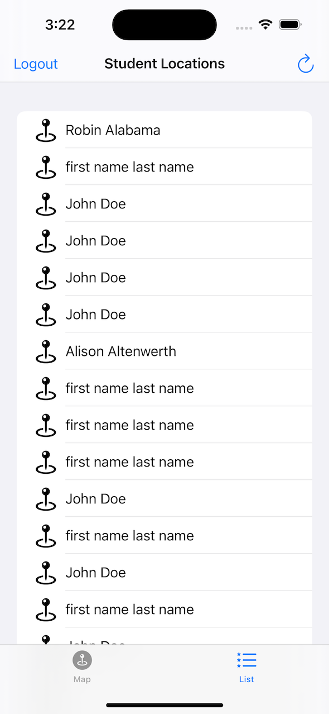

# On The Map - SwiftUI #

This is the refactoring into SwiftUI of my Udacity assignment which I did back in 2016 (I used UIKit at that time). I had to create an app with a map that shows information posted by other students. The map contains pins that show the location where other students have reported studying. 

For security reason, I cannot give you the rest api key or my login details, except if you are my potential co-worker or client. 

The purpose of this repository is just to demonstrate my approach in applying MVVM coordinator pattern as well as MapKit in SwiftUI.
  

**Navigation Flow:** 
1. Login using username and password
2. On successful login, the app will take you to tab view and displaying map view
3. You can also toggle to List view
  

**Technologies used:** Swift 5, SwiftUI, MapKit, RESTful API, Swift Async Await
  

**Screenshots:**

  

